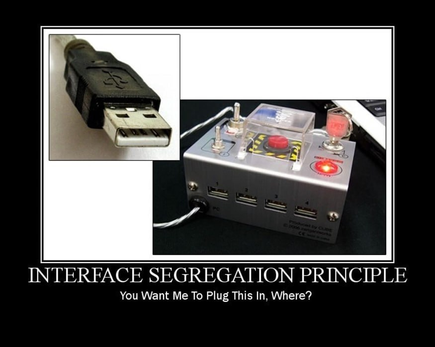
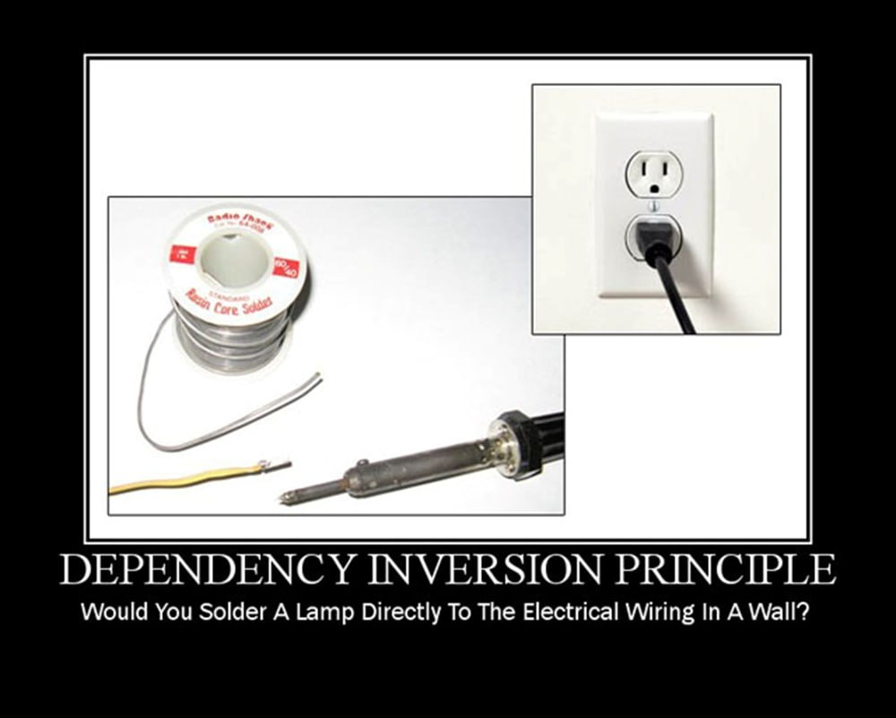

## Princípio da Segregação da Interface (ISP)

**1)** Qual a principal imagem relacionada ao princípio e qual a explicação sobre ela?

    

*A ideia central do ISP é que as classes não devem ser forçados a implementar métodos de uma interface que não usa.*

---

**2)** Por que devemos segregar implementações através do uso de interfaces?

*Segregar implementações através do uso de interfaces é importante para garantir o desacoplamento, tornando as dependências entre os componentes mais claras e menos rígidas.*

---

**3)** Podemos dizer que esse princípio é correlato ao Single Responsability Principle pelo fato de que classes e interfaces devem ter um único “foco” (SRP) e que as interfaces com métodos não correlatos devem ser segregadas (ISP)?

*Sim, pois o ISP afirma que os clientes não devem ser forçados a depender de interfaces que não usam. Dessa forma, as interfaces devem ser pequenas e com um único “foco”, assim como as classes no SRP.*

---

**4)** Comente as seguintes frases à luz do ISP:
> “Nenhum cliente deve ser forçado a depender de métodos que ele não usa”;

*A ideia central do ISP, em que um cliente (classes e algoritmos) não deve ter que implementar métodos de uma interface que não usa.*

> “Classes não devem ser forçadas a implementar interfaces que não usam”;

*Da mesma forma, esta frase reforça a ideia de que as interfaces devem ser pequenas e específicas para suas finalidades (com um único “foco”). Interfaces inchadas podem levar a um alto acoplamento e prejudicam a manutenção do código.*

## Princípio da Inversão de Dependência (DIP)

**5)** Qual a principal imagem relacionada ao princípio e qual a explicação sobre ela?

    

*As classes não devem ser acopladas a outras classes concretas ou a classes que possam ser instanciadas. Em vez disso, as classes devem ser acopladas a outras classes base ou abstratas.*

---

**6)** O que você entende por programar para Interfaces?

*Em programação orientada a objetos, devemos depender de abstrações, não de implementações concretas.*

--- 

**7)** Cite um exemplo em que uma mudança em uma dependência, por exemplo, banco
de dados, ou mecanismo de autenticação ou conexão via sockets poderia impactar
uma implementação de outros módulos.

*Podemos usar como exemplo um sistema que usa um banco de dados MySQL. Nesse sistema temos um módulo que lida com todas as operações do banco de dados. Se esse módulo foi implementado com dependência direta do MySQL, uma eventual mudança de banco de dados (para o PostgreSQL, por exemplo) pode ter um grande impacto em todo o sistema.*

---

**8)** Estude o conteúdo do link abaixo e explique como o DIP se aplicaria:

https://pt.stackoverflow.com/questions/101692/como-funciona-o-padr%C3%A3o-repository

*O padrão Repository propõe uma abstração da persistência de dados, criando uma camada intermediária entre as regras de negócio e o mecanismo de acesso aos dados. Assim, a lógica de negócios interage com um repositório (uma classe independente com responsabilidades desacopladas) ao invés de se comunicar diretamente com a camada de acesso a dados.*

---

**9)** Você acha que esse princípio deveria ser um dos primeiros em um eventual
“check-list” de princípios SOLID a aplicarmos?

*Sim, pois se os princípios OCP e LSP forem cumpridos corretamente, o DIP também estará sendo cumprido. Assim, enquanto OCP indica o objetivo da arquitetura Orientada a Objetos, o DIP indica o mecanismo principal para alcançá-lo.*

---

**10)** Numa visão geral, considera que se começarmos pelos 4 primeiros princípios
SOLID, fatalmente o DIP já estaria implementado?

*Sim, pois quando princípios como o OCP (que promove a extensibilidade das classes sem alterar o código existente) e o LSP (que permite a substituição de classes base por suas derivadas) são aplicados, as classes tendem a depender mais de abstrações, como interfaces, do que de implementações concretas.*

### Referências:
- https://medium.com/contexto-delimitado/o-princ%C3%ADpio-da-invers%C3%A3o-de-depend%C3%AAncia-d52987634fa9

- https://medium.com/contexto-delimitado/o-princ%C3%ADpio-da-segrega%C3%A7%C3%A3o-de-interfaces-2b673374406e

- https://pt.stackoverflow.com/questions/101692/como-funciona-o-padr%C3%A3o-repository